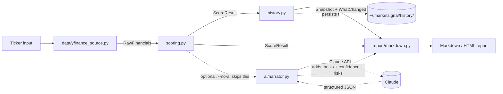

# Architecture

MarketSignal, like RiskLens, is split into a deterministic core and an optional AI layer, so the tool is fully usable and testable without ever calling an external AI service. Unlike RiskLens, its data layer also talks to a real external source (Yahoo Finance), which is isolated the same way the AI layer is: behind one boundary that every test mocks.

## Why it's split this way

- **`scoring.py` is pure**: no I/O, no network calls, no randomness. Given the same `RawFinancials`, it always produces the same `ScoreResult`. That's what makes it fully unit-testable and defensible: you can walk through the weighted-threshold math by hand.
- **`data/yfinance_source.py` is the only module that talks to Yahoo Finance.** Every other module (scoring, history, CLI, web) takes a `RawFinancials` object as input and never knows or cares where it came from. Tests mock this one boundary; nothing else needs network access to be tested.
- **`ai/narrator.py` only narrates, never scores.** It receives the already-computed `ScoreResult` (and the `WhatChanged` diff, if one exists) as structured JSON and is explicitly instructed not to recompute scores, invent metrics, or issue a Buy/Hold/Sell recommendation.
- **`history.py` writes outside the repository entirely** (`~/.marketsignal/history/`, overridable via `MARKETSIGNAL_HISTORY_DIR` for tests). This is real personal research data, not sample data, and it must never be able to end up in the public repo.

## Data flow

1. `data/yfinance_source.py` fetches current fundamentals and a year of price history for a ticker and returns a `RawFinancials` object. Missing fields stay `None`; not every ticker publishes every metric.
2. `scoring.py` computes a weighted 0-4 signal score per metric, category, and overall, excluding unavailable metrics from their category's average rather than penalizing them.
3. `history.py` loads any prior snapshots for that ticker, computes a `WhatChanged` diff against the most recent one (if any), and appends the new snapshot.
4. `report/markdown.py` renders the deterministic result. If AI narration was requested, `ai/narrator.py` is called with the structured scores and diff, and its output is merged into the same report.
